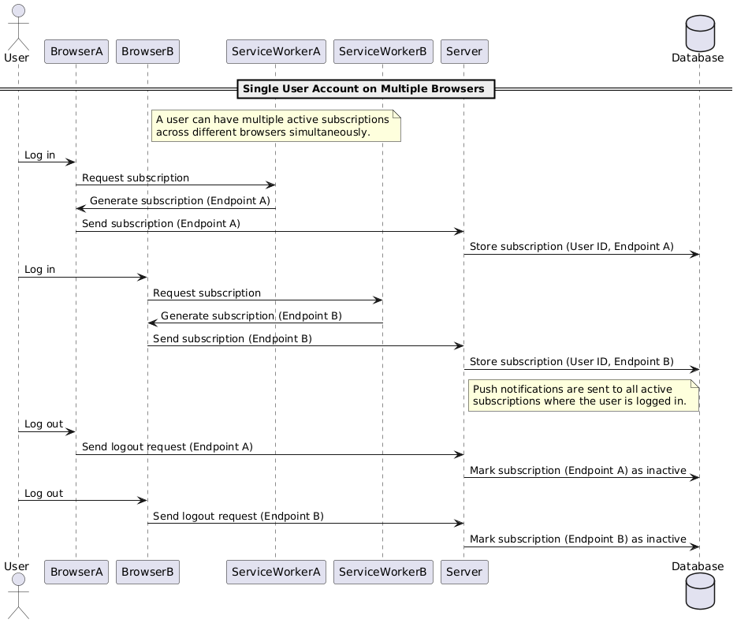

# README: Push Notifications Subscription

## Features and Scenarios

### Features

1. **Unique Subscriptions:**

   - Each user receives a distinct push notification subscription per browser. This ensures that notifications are sent to the correct browser instance where the user is logged in.

2. **Account Switching:**

   - When a user logs out and logs into a different account on the same browser, the old subscription is marked as inactive, and a new subscription is created for the new account. This prevents notifications from being sent to the wrong user.

3. **Notification Delivery:**
   - Notifications are sent only to the active subscriptions of the currently logged-in user. This means that notifications will only be delivered to the browser where the user is actively logged in.

### Scenarios

1. **Single User Account on Multiple Browsers:**

   - A single user logs into multiple browsers. Each browser maintains its own unique subscription. Notifications are sent to all active browsers where the user is logged in.

2. **Different User Accounts on a Single Browser:**
   - A single browser can be used to log in with multiple user accounts. Only one subscription is active at a time, corresponding to the currently logged-in user. The subscription is updated when switching accounts.

</br>
</br>

## Flow Explanation

### 1. **Subscribing to Push Notifications**

1. **Request Permission:**

   - **User** initiates a request for notification permission.
   - **Browser** displays a permission dialog to the user.
   - **User** grants permission to receive notifications.

2. **Generate Subscription:**

   - **Browser** requests **ServiceWorker** to generate a push notification subscription.
   - **ServiceWorker** generates a subscription, which includes a unique endpoint for that browser, and returns it to the **Browser**.

3. **Store Subscription:**
   - **Browser** sends the subscription details (including the unique endpoint) to **Server**.
   - **Server** stores the subscription information in the **Database**.

### 2. **Managing Login/Logout**

1. **User Login:**

   - **User** logs into the application via **Browser**.
   - **Browser** sends a login request to **Server**.
   - **Server** updates the **Database** to mark the user’s subscription as active.

2. **User Logout:**
   - **User** logs out from **Browser**.
   - **Browser** sends a logout request to **Server**.
   - **Server** updates the **Database** to mark the user’s subscription as inactive.

### 3. **Sending/Receiving Notifications**

1. **Send Message:**

   - **User2** sends a message to **User1**.
   - **Browser** sends a message request to **Server**.
   - **Server** stores the message in the **Database**.

2. **Check Subscriptions:**

   - **Server** queries the **Database** for active subscriptions for **User1**.
   - **Server** retrieves the active subscriptions.

3. **Send Push Notification:**
   - **Server** sends the push notification to **ServiceWorker**.
   - **ServiceWorker** processes and sends the push notification to **Browser**.
   - **Browser** displays the notification to **User1**.

</br>
</br>

## Subscription Management Scenarios

### 1. **Single User Account on Multiple Browsers**

**Scenario:**
**User1** logs into multiple browsers (A and B).

**Steps:**

1. **Login on Browser A:** Generates and stores subscription (Endpoint A).
2. **Login on Browser B:** Generates and stores a new subscription (Endpoint B).
3. **Logout from Browser A:** Marks Endpoint A as inactive.
4. **Logout from Browser B:** Marks Endpoint B as inactive.

**Key Points:**

- Notifications are sent to all active subscriptions (Browsers A and B).

### 2. **Different User Accounts on a Single Browser**

**Scenario:**
**User1** switches accounts on the same browser.

**Steps:**

1. **Login with Account A:** Generates and stores subscription (Endpoint A).
2. **Switch to Account B:** Logs out from Account A, generates a new subscription (Endpoint B), and stores it.
3. **Logout from Account B:** Marks Endpoint B as inactive.

**Key Points:**

- Only one subscription is active per browser, corresponding to the currently logged-in user.

</br>
</br>
</br>

## Diagrams

1. `Push Notification Subscription Flow`

This diagram illustrates the process of subscribing to push notifications.

[](./push_subscription_quick_overview.png)

2. `Single User Account on Multiple Browsers`

This diagram shows how a single user account can manage subscriptions across multiple browsers.

[](./Single_User_Account_on_Multiple_Browsers.png)

3. `Different User Accounts on Single Browser`

This diagram depicts the handling of different user accounts accessing the service from a single browser.

[](./Different_User_Accounts_on_Single_Browser.png)

4. `Service Worker Registration Flow for Frontend Applications`

This diagram provides a detailed view of the service worker registration process, crucial for enabling features such as offline support and push notifications in web applications.

[](./service_workers_registration_flow.png)

Here’s a revised version of the glossary section, including an example to clarify each term:

## Glossary

- **ServiceWorker:** A background script that handles push notifications and other background tasks. For example, it intercepts push messages and displays notifications to the user.

- **Endpoint:** A unique URL that identifies where push notifications should be sent for a specific browser. It is part of the subscription object. For instance:

  ```json
  "endpoint": "https://fcm.googleapis.com/fcm/send/dB-4BEbPvPU:APA91bFQ0k9bcISHr4m5GRNeoAvUUg2ffedfd8zrVZEIGcYq_srJiaz2PKVHFK0PfYXXQJFzcj6sIt4DFPM0IVQOMAwCcK4LsKRmvRhyR_7HfO6jYI3AzceX7lybBtYylBeOrkCS6shz"
  ```

  This URL is used by the push service to deliver notifications to the correct browser instance.

- **Subscription:** A record that includes all the necessary information for sending push notifications to a browser. It contains the endpoint and keys required for secure communication. An example of a subscription object:
  ```json
  {
    "endpoint": "https://fcm.googleapis.com/fcm/send/dB-4BEbPvPU:APA91bFQ0k9bcISHr4m5GRNeoAvUUg2ffedfd8zrVZEIGcYq_srJiaz2PKVHFK0PfYXXQJFzcj6sIt4DFPM0IVQOMAwCcK4LsKRmvRhyR_7HfO6jYI3AzceX7lybBtYylBeOrkCS6shz",
    "expirationTime": null,
    "keys": {
      "p256dh": "BP9JRZIe_niVnZOSmzdlxu8mO2c58cjiW7CiXti2juiNvea1ICdeiMAKklyOduNH6OkBnf8p4Hxn466EAuzs2nE",
      "auth": "5q1Rdu20s3HRNIZKcY3sUw"
    }
  }
  ```
  - **endpoint:** The URL where notifications are sent.
  - **expirationTime:** When the subscription expires (if applicable).
  - **keys:** Includes `p256dh` and `auth` keys used for encrypting messages.
